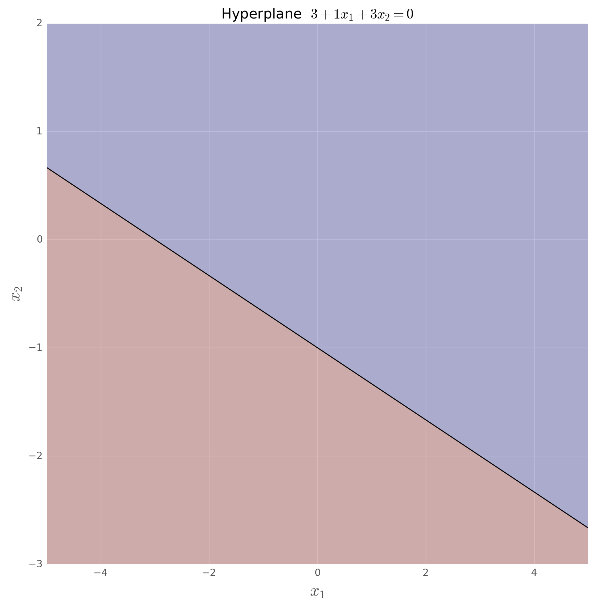

% Support Vector Machines
% Juan Shishido
% April 20, 2016

# Objectives

## Objectives

Understand hyperplanes and margins

Build an intuition for how to tune a support vector classifier

Learn how to handle non-linearly separable data

* transforming data
* using kernels

Get a sense of how multi-class classification works

# Introduction

## Introduction

>Support vector machines (SVMs) are a set of supervised learning methods used
 for classification, regression, and outliers detection.

* effective in high-dimensional spaces
    * however, poor performance if the number of features is much greater than
      the number of samples
* memory efficient
* versatile

Considered one of the best "out of the box" classifiers

## Notation

$X$ is an $n \times p$ matrix

* $n$ samples
* $p$ dimensions

$y$ is a vector of class labels

* $y_1, \dots, y_n \in \{-1, 1\}$

## Hyperplane

>In $p$-dimensional space, a *hyperplane* is a flat affine subspace of
 dimension $p-1$.

Not required to pass through the origin

* in two dimensions: line
* in three dimensions: plane
* in $p$ > 3 dimensions: hyperplane

## Hyperplane

In two dimensions:

$$\beta_0 + \beta_1x_1 + \beta_2x_2 = 0$$

In $p$ dimensions:

$$\beta_0 + \beta_1x_1 + \beta_2x_2 + \dots + \beta_px_p = 0$$

The $x$ for which these equations hold are points on the hyperplane

## Hyperplane

Alternatively:

$$\beta_0 + \beta^Tx = 0 \quad \text{or} \quad w^Tx + b = 0$$

In cases where $x$ does not satisfy the equation of the hyperplane, $x$ lies to
one side of it

This is determined by the sign of the equation of the hyperplane

## Hyperplane

The hyperplane divides the $p$-dimensional space into two halves

# Maximal Margin Classifier

## Hyperplanes for Classification

The separating hyperplane perfectly separates samples according to their class
labels

For this, the data must be linearly separable

## Linearly Separable

What is the optimal hyperplane

## Linearly Separable

An infinite number of hyperplanes exist

## Maximal Margin Hyperplane

The maximal margin hyperplane is the separating hyperplane which is farthest
from the training samples

The farthest from *particular* samples&mdash;those on the margin

The **margin** is the smallest perpendicular distance between a separating
hyperplane and a sample

## Maximal Margin Hyperplane

The goal is to maximize the margin

## Why Large Margins

The margin is the distance from the maximal margin hyperplane&mdash;the solid
line&mdash;and either of the dashed lines

>[T]he distance of a sample from the hyperplane can be seen as a measure of
confidence that the observation was correctly classified

The farther the distance, the more confident we can be about its assignment

## Support Vectors

The highlighted points&mdash;one blue and two red&mdash;are the support vectors

>[T]hey "support" the maximal margin hyperplane in the sense that if these
points were moved slightly then the maximal margin hyperplane would move as
well

So long as the *other* samples do not cross the boundary set by the margin,
they are free to move around without affecting the maximal margin hyperplane

## Sensitive

The maximal margin classifier is sensitive to its support vectors

## Sensitive

Because of the smaller margin, we are less confident about any assignments
based on this separating hyperplane

The fact that the maximal margin hyperplane is so sensitive suggests that it
may have overfit the training data

## Non-Separable

In addition to this, it's likely that a separating hyperplane doesn't even
exist

What we can do is find the hyperplane that *almost* perfectly separates the
classes

* using what's called a *soft margin*

# Support Vector Classifier

## Tradeoffs

We trade a separating hyperplane for one that:

* is more robust to individual samples
* can better classify *most* training samples

The support vector classifier allows some samples to be on the wrong side of
the margin or even the wrong side of the hyperplane

## Soft Margins

Now, not sensitive to the additional data point

## Decision Boundary (Hard Margin)

Select $w$ and $b$ so that the training data may be described by:

$$w^Tx_i + b \geq +1 \quad \text{ for } y_i = +1$$
$$w^Tx_i + b \leq -1 \quad \text{ for } y_i = -1$$

Rewritten as:

$$ y_i(w^Tx_i + b) \geq 1 \quad \forall i$$

## Decision Boundary (Hard Margin)

Maximize the margin

The margin is equal to $\frac{1}{\|w\|}$ and maximizing it subject to the
constraint is equivalent to:

$$min \frac{1}{2}\|w\|^2 \quad s.t. \quad y_i(w^Tx_i + b) \geq 1 \quad \forall i$$

## Slack Variables

In order to have soft margins, we need slack variables

These allow individual samples to be on the wrong side of the margin or
hyperplane

The slack variable $\epsilon_i$ tells us where the $i$th sample is located,
relative to the hyperplane and margin

* $\epsilon_i = 0$: correct side of the margin
* $\epsilon_i > 0$: wrong side of the margin
* $\epsilon_i > 1$: wrong side of the hyperplane

## Decision Boundary (Soft Margin)

The constraint now becomes:

$$ y_i(w^Tx_i + b) \geq 1 - \epsilon_i \quad \text{where} \quad \epsilon_i \geq 0 \quad \forall i$$

Objective:

$$min \frac{1}{2}\|w\|^2 + C \sum_{i=1}^L \epsilon_i \quad s.t. \quad y_i(w^Tx_i + b) \geq 1 - \epsilon_i \quad \forall i$$

## Decision Boundary (Soft Margin)

Data points on the wrong side of the margin have a penalty that increases with
the distance from it

>The parameter $C$ controls the trade-off between the slack variable penalty
and the size of the margin.

## Not Linearly Separable

Soft margins needed

## Not Linearly Separable

With soft margins C = 0.01

## Not Linearly Separable

With soft margins C = 0.001

# Support Vector Machines

## Non-linear Decision Boundaries

What can we do when we have non-linear decision boundaries

## Non-linear Decision Boundaries

We can transform the data into higher-dimensional space

In regression, we've done this by adding a quadratic term

Support vector machines convert linear classifiers into ones that produce
non-linear decision boundaries

In the enlarged feature space, the decision boundary is linear

In the original feature space, though, solutions are generally non-linear

## Transformed

Included $x_1^2 + x_2^2$

## Kernels

In the previous example, we explicitly transformed the data to $\mathbb{R}^3$

There are many ways to enlarge the feature space

It's possible for this to result in a very large number of features

Support vector machines enlarge the feature space using *kernels*

## Kernels

An efficient computational approach for enlarging the feature space

The solution to the support vector classifier problem involves only the inner
products (dot products) of the data

Only needed for the support vectors

The following is a generalization of the inner product:

$$K(x_i, x_{i'})$$

## Kernels

One example of $K$ is:

$$K(x_i, x_{i'}) = \sum_{j=i}^p x_{ij}x_{i'j}$$

This is simply the linear kernel

## Kernels

The polynomial kernel is defined as:

$$K(x_i, x_{i'}) = (1 + \sum_{j=i}^p x_{ij}x_{i'j})^d$$

where $d$ is a positive integer

## Kernels

The kernel is a function that quantifies the similarity of two samples

>When the support vector classifier is combined with a non-linear kernel, the
resulting classifier is known as a support vector machine.

Popular kernels:

* linear
* polynomial
* rbg (radial basis function)

# Multi-class Classification

## One-vs-One

Constructs SVMs for every pair of classes

A test sample is classified using each of the classifiers

It is assigned to the class to which is was most frequently assigned

## One-vs-Rest

Constructs SVMs for every class

The test sample is assigned to the class for which $w^Tx + b$ is the largest

>[T]his amounts to a high level of confidence that the test observation belongs
to the $k$th class rather than any of the other classes

# Thank You
